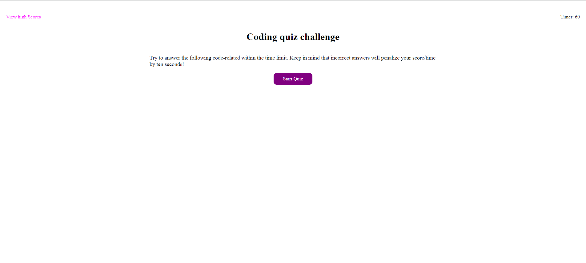
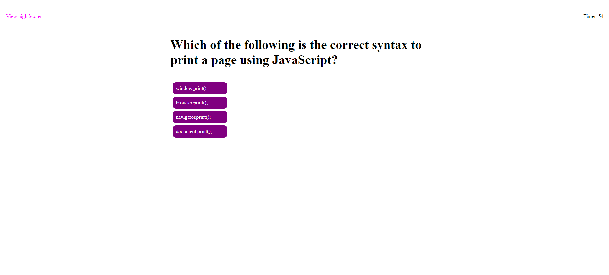
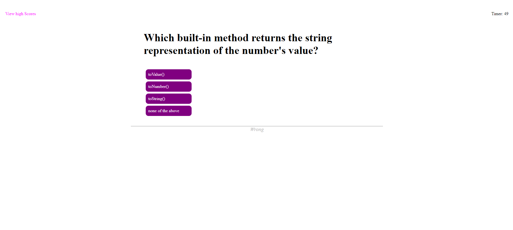
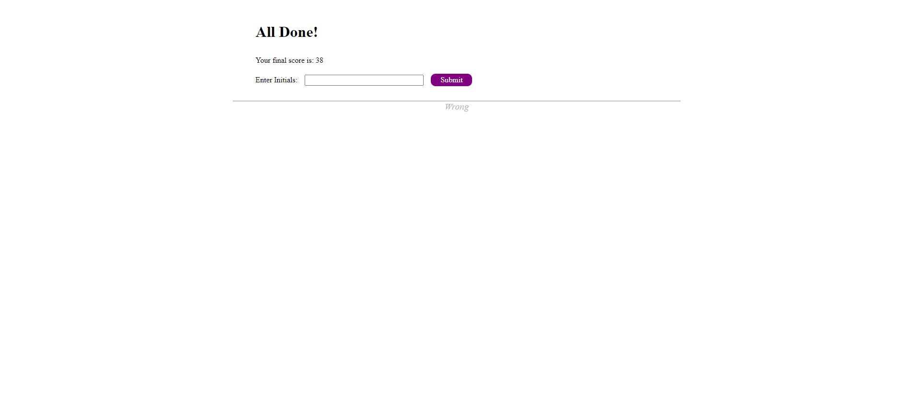
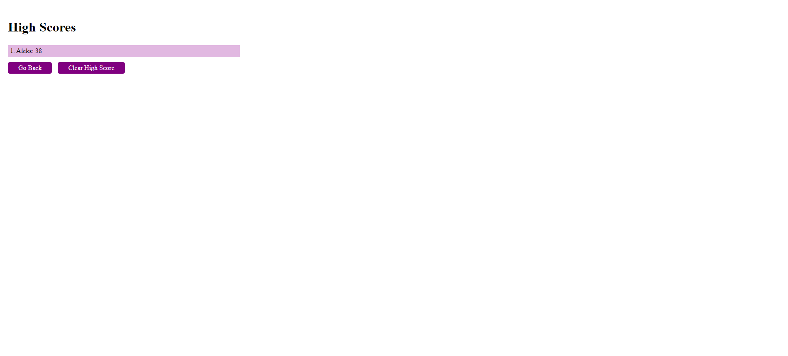
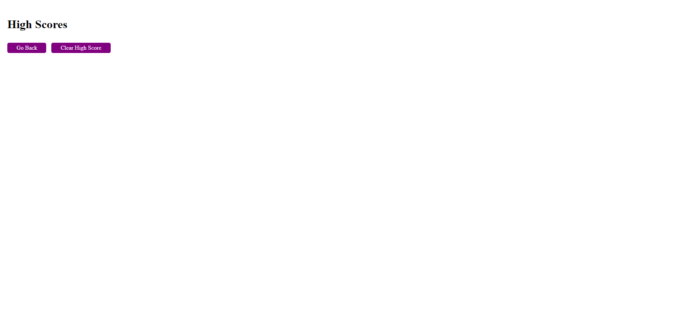

# My First Quiz

## Description

"My First Quiz" is an app designed to test your knowledge on a variety of topics and challenge your brain with fun and engaging questions. With a user-friendly interface and sleek design, it is the perfect way to spend some free time and learn something new.

The app features a variety of questions on different topics related to javascrip. Each question have multiple-choices, and users can select their answers by clicking on the options provided. If a user selects the wrong answer, the app will provide immediate feedback and indicate which answer was correct.

To keep things exciting, My First Quiz includes a timer for the quiz, giving users a set amount of time to answer all the questions. At the end of each quiz, users will receive a score based on the number of correct answers they got and how quickly they answered the questions. They can even save their score in the local storage of the browser. The app also includes a high score board, which displays the highest scores achieved by users.

## Table of contents

- [Installation](#installation)
- [Usage](#usage)
- [Screenshot](#screenshot)
- [Contribution](#contribution)
- [Questions](#questions)
- [License](#license)

## Installation

Follow the link of the deployed application [My First Quiz](https://aleksandrbausher.github.io/My-First-Quiz-/) ,

Otherwise clone GitHub repository [My First Quiz](https://github.com/AleksandrBausher/My-First-Quiz-)

## Usage
Click here to access my [My First Quiz](https://aleksandrbausher.github.io/My-First-Quiz-/), 
To know more about me and my projects

## Screenshot

## Contribution

Application was created by Aleksandr Bausher and if you want to contribute send me email.

## Questions

My Email:
[aleksandrbausher@gmail.com](mailto:aleksandrbausher@gmail.com)
My Github:
[AleksandrBausher](https://github.com/aleksandrbausher)

## License

